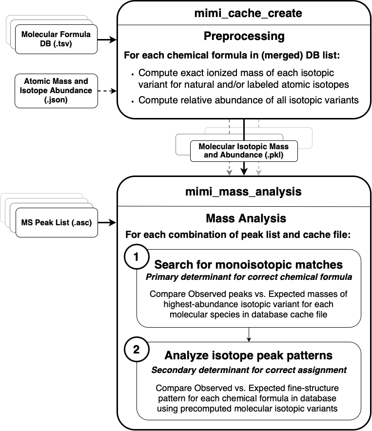
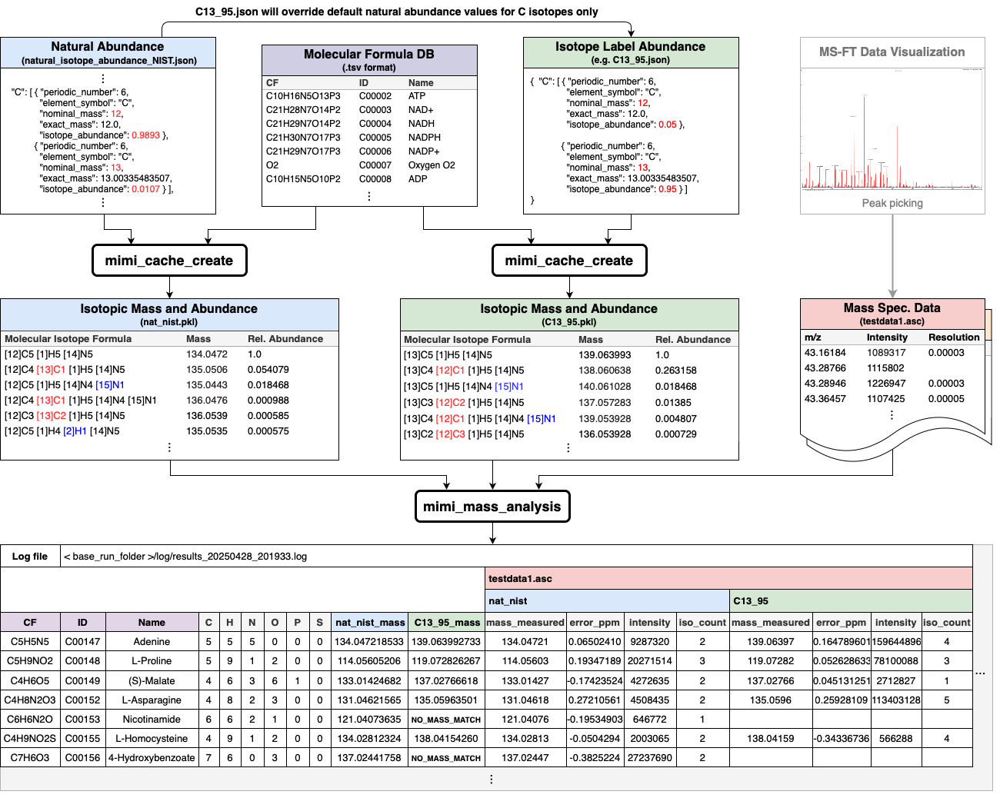

Architecture Design
====================

Overview
--------
MIMI's architecture is designed around efficient mass spectrometry data processing and analysis. The system follows a modular design pattern with clear separation of concerns between data handling, processing, and analysis components.

Detailed Flow Diagram
----------------------

Core Components
---------------

1. Data Input Layer
~~~~~~~~~~~~~~~~~~~
- **Sample Processor**: Handles mass spectrometry data input from ASC files
- **Database Connectors**: Interfaces with KEGG and HMDB metabolite databases
- **Cache Manager**: Manages binary cache files for efficient data retrieval

2. Processing Engine
~~~~~~~~~~~~~~~~~~~~
- **Formula Parser**: Parses chemical formulas into atomic components
- **Mass Calculator**: Computes molecular masses with ionization adjustments
- **Isotope Handler**: Manages isotope patterns and abundance calculations
- **PPM Calculator**: Handles mass tolerance calculations for matching

3. Analysis Layer
~~~~~~~~~~~~~~~~~
- **Pattern Matcher**: Matches mass patterns between samples and reference data
- **Isotope Validator**: Validates isotope patterns for compound identification
- **Result Formatter**: Organizes and formats analysis results

Data Flow
---------

1. **Preprocessing Phase**
   - Chemical formulas are parsed from databases (KEGG, HMDB)
   - Molecular masses are calculated for each compound
   - Isotope variants are computed and stored in cache files

2. **Analysis Phase**
   - Mass spectrometry data is loaded from sample files
   - Sample masses are compared against cached molecular masses
   - Matches are verified using isotope patterns
   - Results are filtered based on PPM tolerance settings

3. **Output Phase**
   - Matched compounds are organized by confidence level
   - Results are formatted into tabular output
   - Detailed information is provided for each match

Key Design Principles
---------------------

1. **Efficiency**: Hash-based indexing for fast mass lookups
2. **Flexibility**: Support for multiple ionization modes and isotope labeling
3. **Precision**: PPM-based matching for high accuracy identification
4. **Scalability**: Batch processing capabilities for multiple samples
5. **Modularity**: Clear separation between components for maintainability

Implementation Details
----------------------

- **Atom Module**: Handles atomic data and isotope information
- **Molecule Module**: Processes molecular formulas and calculates masses
- **Analysis Module**: Coordinates the analysis workflow
- **Cache Creation**: Precomputes molecular data for faster analysis
- **Database Connectors**: Extract compound information from external sources 